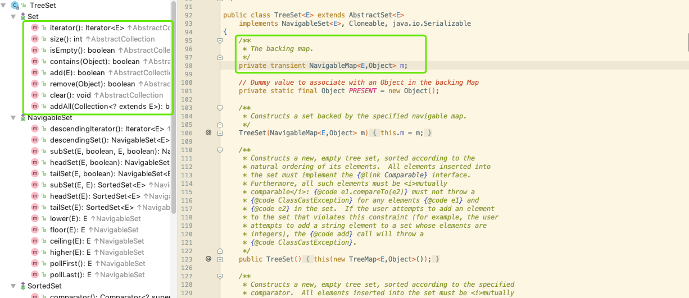

### 集合
类|特点
---|---
TreeSet|基于红黑树实现，支持有序性操作，例如根据一个范围查找元素的操作。
HashSet|基于哈希表实现，支持快速查找，但不支持有序性操作。并且失去了元素的插入顺序信息，也就是说使用 Iterator 遍历 HashSet 得到的结果是不确定的。
LinkedHashSet|具有 HashSet 的查找效率，且内部使用双向链表维护元素的插入顺序。
ArrayList|基于动态数组实现，支持随机访问。
Vector|和 ArrayList 类似，但它是线程安全的。
LinkedList|基于双向链表实现，只能顺序访问，但是可以快速地在链表中间插入和删除元素。不仅如此，LinkedList 还可以用作栈、队列和双向队列。
PriorityQueue|基于堆结构实现，可以用它来实现优先队列。
TreeMap|基于红黑树实现。
HashMap|基于哈希表实现
HashTable|和 HashMap 类似，但它是线程安全的，这意味着同一时刻多个线程可以同时写入 HashTable 并且不会导致数据不一致。它是遗留类，不应该去使用它。
ConcurrentHashMap|和 HashMap 类似，但它是线程安全的，比HashTable效率更高，因为引入分段锁
LinkedHashMap|使用双向链表来维护元素的顺序，顺序为插入顺序或者最近最少使用（LRU）顺序。

### 分析
- TreeSet
<div align="center">  </div><br>

> TreeSet基于红黑树实现，其主要的逻辑均在TreeMap源码中可以看到
```java
public class TreeSet<E> extends AbstractSet<E>
    implements NavigableSet<E>, Cloneable, java.io.Serializable
```
- add
```java
    public boolean add(E e) {
        return m.put(e, PRESENT)==null;
    }
```
- m.put(e, PRESENT)方法如下（如何正确的插入节点到树中）
```java
    public V put(K key, V value) {
        Entry<K,V> t = root; // 当前节点
        // 如果tree是空树，直接插入
        if (t == null) {
            compare(key, key); // type (and possibly null) check
            // K V 赋值给Entry节点，赋值根节点
            root = new Entry<>(key, value, null);
            // 容器size=1
            size = 1;
            // 修改次数+1
            modCount++;
            return null;
        }
        int cmp;
        // 定义父节点
        Entry<K,V> parent;
        // 比较器 用来比较大小
        Comparator<? super K> cpr = comparator; // 指定排序算法
        // 如果cpr不为空，则采用既定的排序算法进行创建TreeMap集合
        if (cpr != null) {
            do {
                // 指向容器中最近添加的节点
                parent = t;
                // 比较本次新增key 和上次节点key值
                cmp = cpr.compare(key, t.key);
                // 新怎key 小于 上次key 新增key就作为上次key的左叶子节点
                if (cmp < 0)
                    t = t.left;
                // 新增key 大于上次key 新增key就作为上次key的右叶子节点
                else if (cmp > 0)
                    t = t.right;
                // key值相等，直接覆盖
                else
                    return t.setValue(value);
            } while (t != null);
        }
        else {
            if (key == null)
                throw new NullPointerException();
            @SuppressWarnings("unchecked")
                Comparable<? super K> k = (Comparable<? super K>) key;
            do {
                parent = t;
                cmp = k.compareTo(t.key);
                if (cmp < 0)
                    t = t.left;
                else if (cmp > 0)
                    t = t.right;
                else
                    return t.setValue(value);
            } while (t != null);
        }
        // 将新增节点当做parent的子节点
        Entry<K,V> e = new Entry<>(key, value, parent);
        // 如果新增节点的key小于parent的key，则当做左子节点
        if (cmp < 0)
            parent.left = e;
        else
            parent.right = e;
        // 对这棵树进行调整、平衡
        fixAfterInsertion(e);
        size++;
        modCount++;
        return null;
    }
```