# Jvm深入理解

  > 根据在网上博客中看到Jvm思维导图，根据导图深入理解Jvm。原博客[地址](https://blog.yu000hong.com/2019/01/10/inside-jvm.html)

## 概述

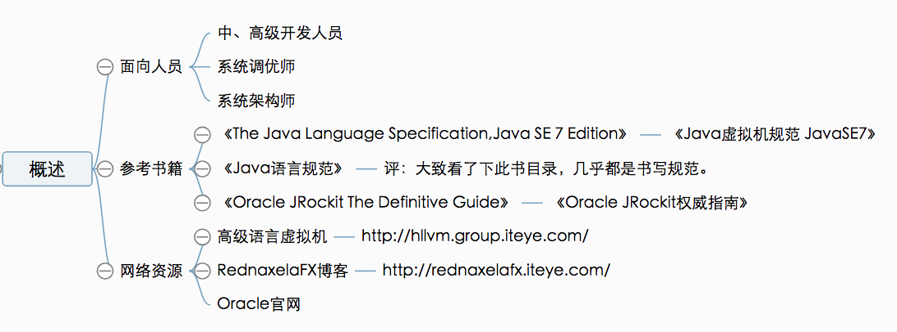

## 技术体系

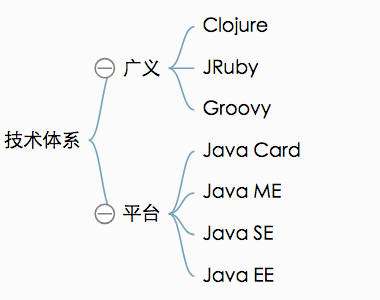

## JDK

## JRE

## 发展历史

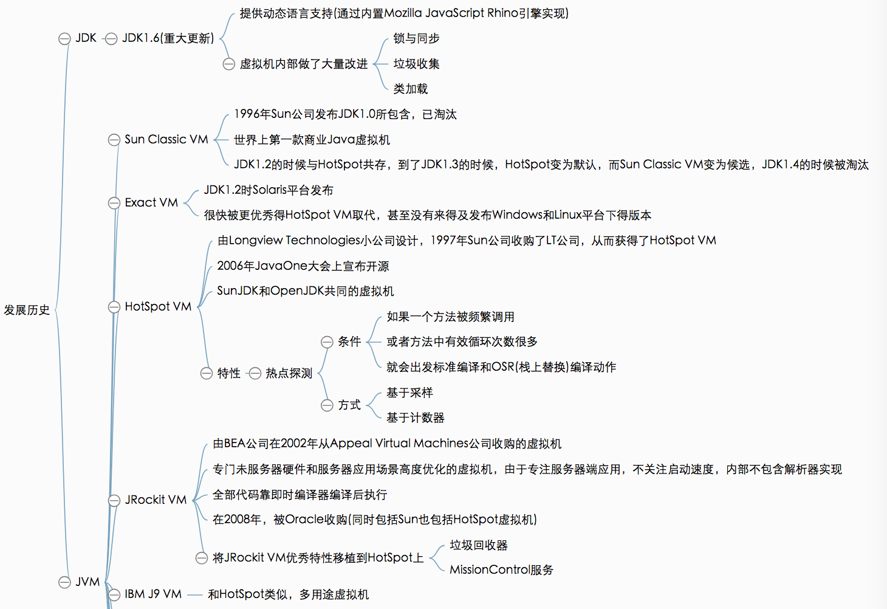

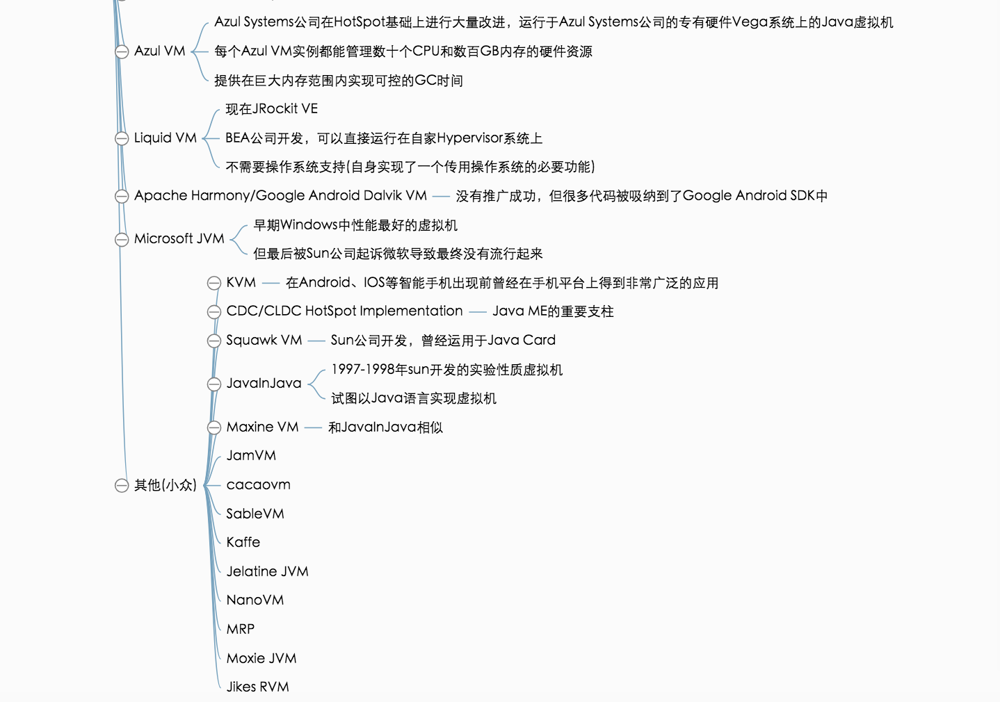

## 未来

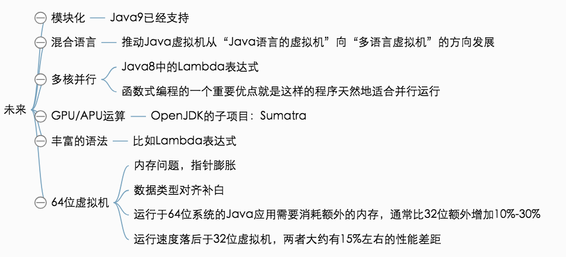

## 编译JDK

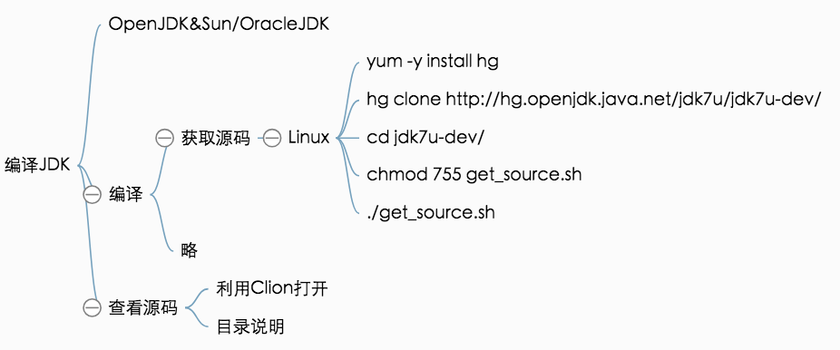

## 线程共享区

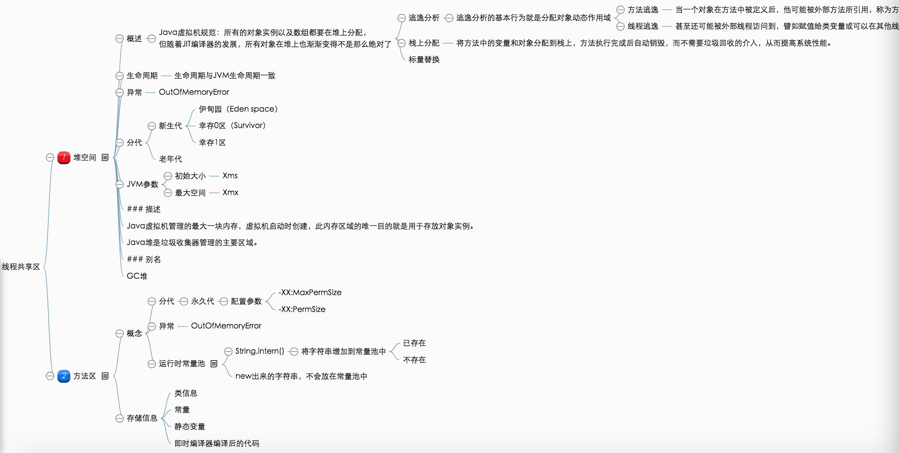

## 线程私有区

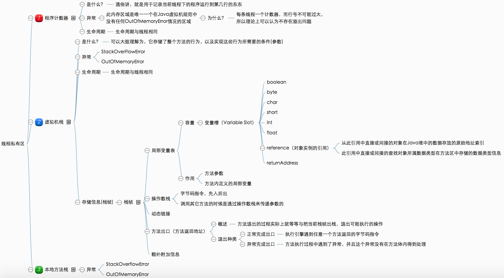

## JAVA对象

## 异常

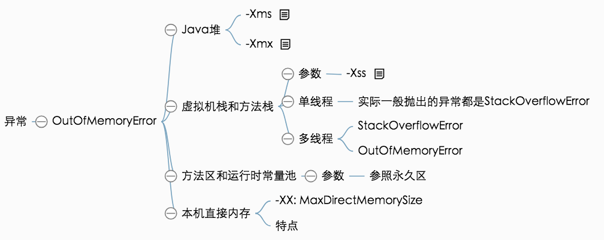

## 垃圾收集器

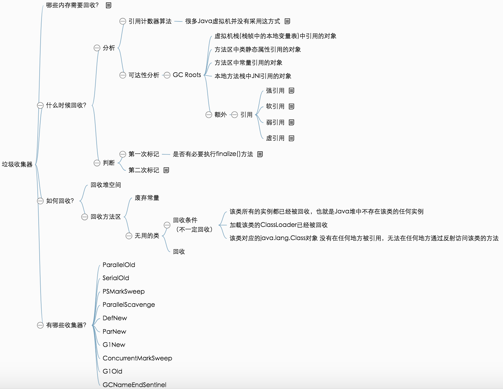

## 垃圾收集算法

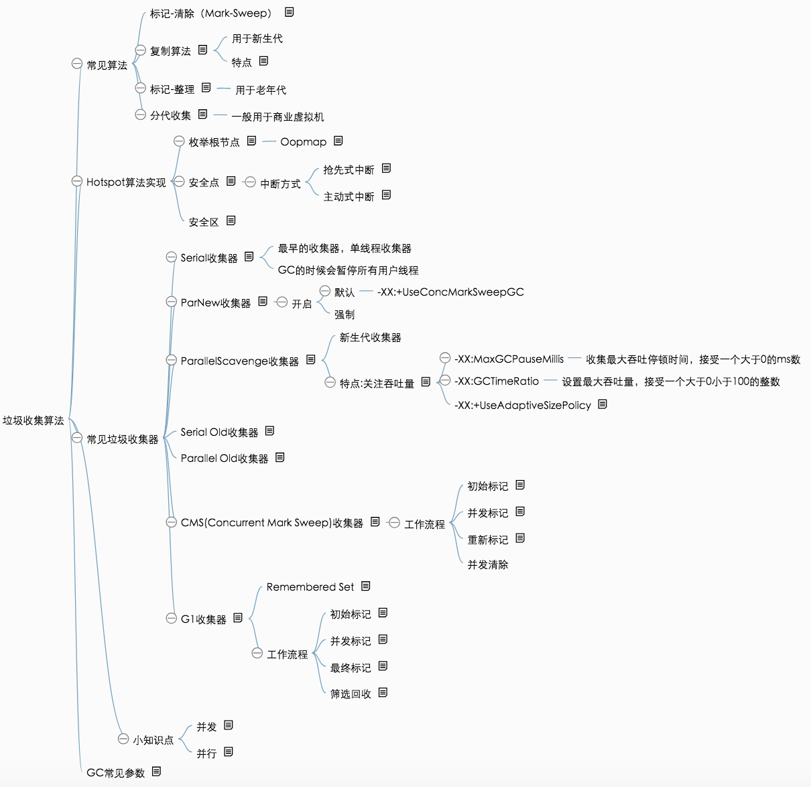

## 分配与回收

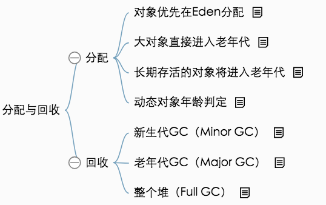

## JDK工具

## 数据类型

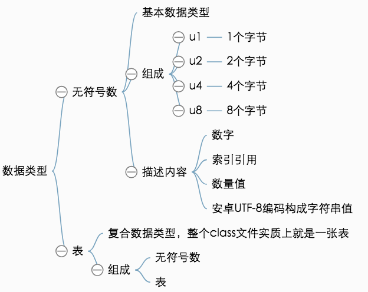

## 魔数与Class文件版本

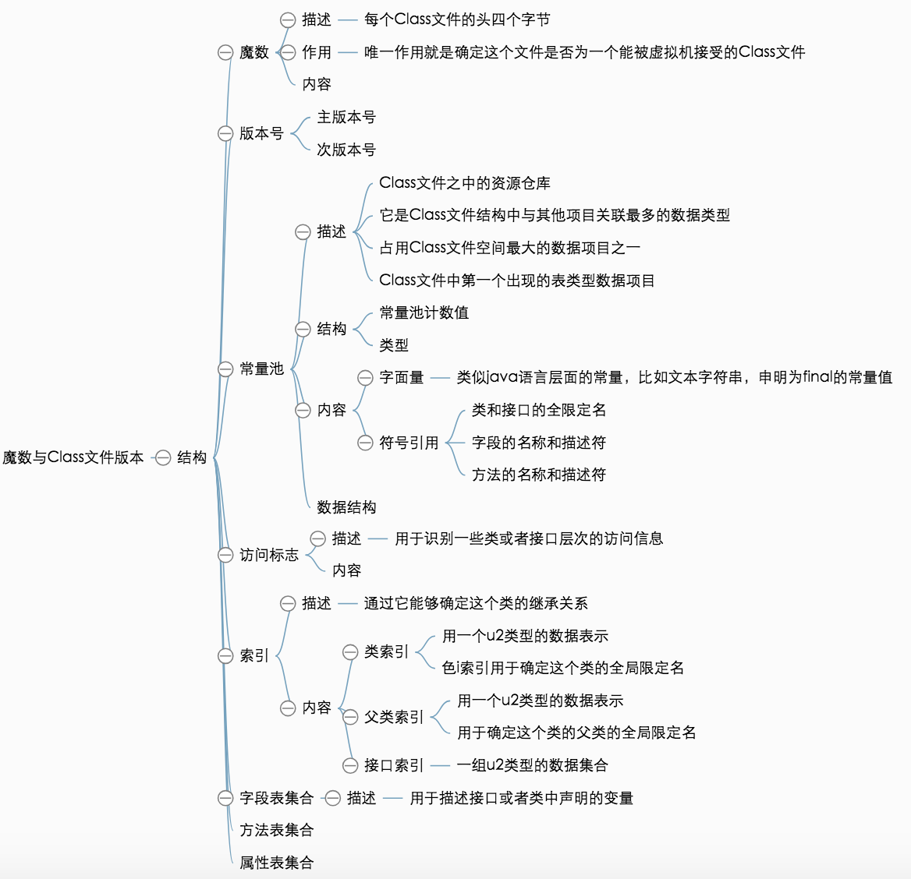

## 字节码指令

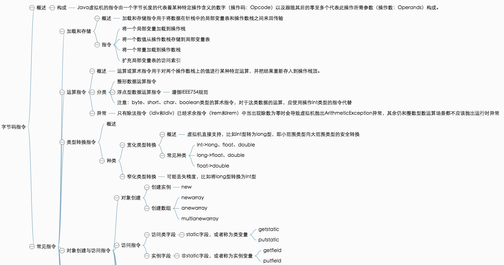

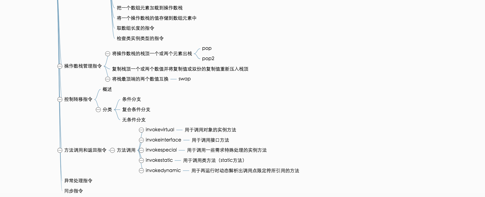

## 类加载机制

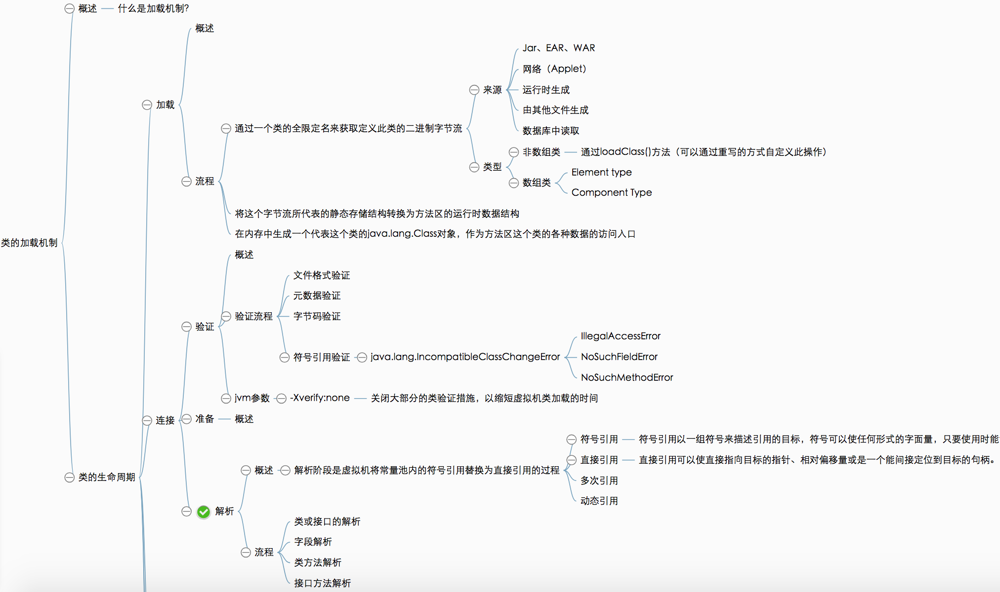

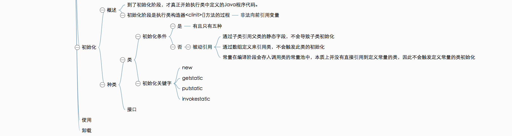

## 类加载器

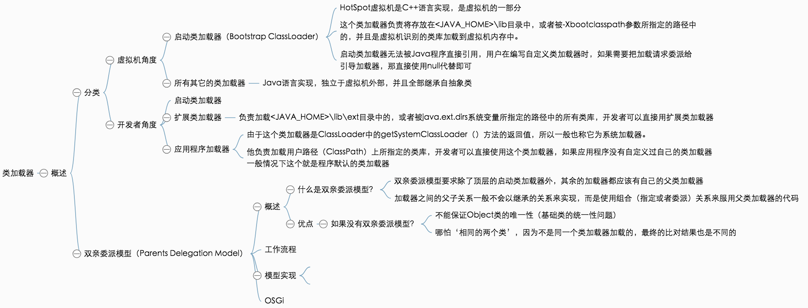

## 执行引擎

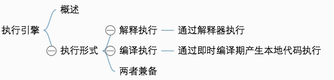

## 方法调用

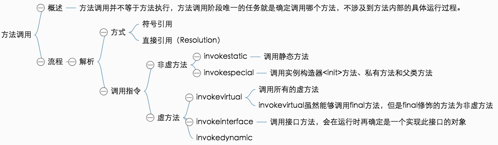

## 分派

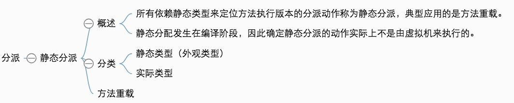

## 高效并发

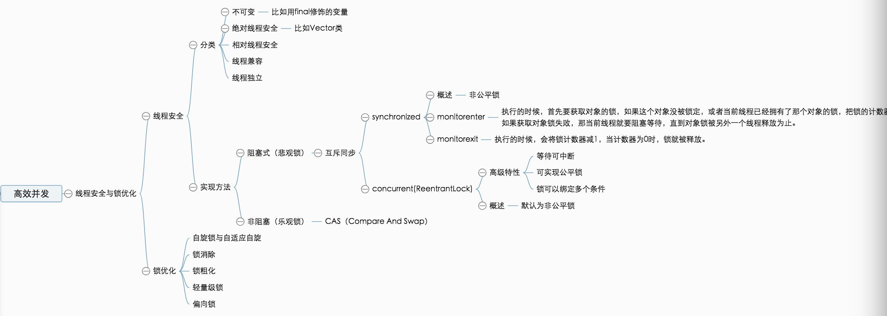
